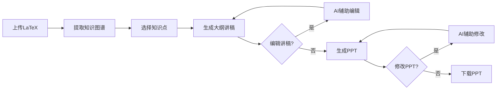

<div align="center">

# 📚 EduAgent - 课堂视频生成系统

### 智能教学视频生成系统 - 让教学更高效

[](LICENSE)
[](https://www.python.org/)
[](https://reactjs.org/)
[](https://fastapi.tiangolo.com/)

[功能特性](#-功能特性) • [快速开始](#-快速开始) • [项目结构](#-项目结构) • [开发指南](#-开发指南) • [常见问题](#-常见问题)


**上海交通大学**

</div>

---

## 📖 项目简介

**EduAgent** 是一个基于大语言模型（LLM）的智能教学视频生成系统。通过上传 LaTeX 格式的教材内容，系统能够自动提取知识图谱、生成教学大纲和讲稿，并最终生成专业的教学 PPT。

### 🎯 核心价值

- **自动化内容生成**：从教材到 PPT 的全流程自动化
- **AI 辅助编辑**：支持多轮对话式讲稿编辑，智能理解修改需求
- **知识图谱可视化**：直观展示知识点之间的关联关系
- **灵活定制**：支持多种教学风格、详细程度的自定义设置

### 🏗️ 技术架构

```
┌─────────────────────────────────────────────────────────┐
│                      前端 (React)                        │
│  上传界面 → 知识图谱可视化 → 讲稿编辑 → PPT生成与修改  │
└─────────────────┬───────────────────────────────────────┘
                  │ HTTP/REST API
┌─────────────────▼───────────────────────────────────────┐
│                    后端 (FastAPI)                        │
│  LaTeX解析 → 知识图谱提取 → LLM调用 → PPT生成          │
└─────────────────┬───────────────────────────────────────┘
                  │
┌─────────────────▼───────────────────────────────────────┐
│              大语言模型 (Gemini 3 Pro)                   │
│     知识提取 • 内容生成 • 智能编辑 • 风格优化          │
└─────────────────────────────────────────────────────────┘
```

---

## ✨ 功能特性

### 🔄 完整工作流程



### 📋 详细功能

#### Step 1: 上传与知识图谱提取
- ✅ 支持 LaTeX (.tex) 文件上传
- ✅ 自动解析章节结构和数学公式
- ✅ 智能提取知识点及其关联关系
- ✅ D3.js 可视化知识图谱
- ✅ 显示知识点类型（定义、定理、方法、应用）

#### Step 2: 大纲与讲稿生成
- ✅ 可选择任意知识点组合
- ✅ 三种详细程度：精讲、标准、粗讲
- ✅ 四种PPT风格：简约、学术、商务、活泼
- ✅ 自定义教学要求（可选）
- ✅ 生成结构化讲稿（开场白、知识点讲解、总结）

#### Step 2.5: AI 辅助讲稿编辑 ⭐
- ✅ 类似 Claude 的对话式编辑界面
- ✅ 实时预览当前讲稿
- ✅ 支持多轮修改迭代
- ✅ 自然语言修改指令（如"第一章节需要更生动"）
- ✅ 修改历史记录

#### Step 3: PPT 生成与修改
- ✅ 基于讲稿自动生成 PPT
- ✅ 模板选择（现代、专业、简约）
- ✅ 支持下载 .pptx 格式
- ✅ AI 辅助 PPT 修改（待完善）

---

## 🚀 快速开始

### 📋 前置要求

- **Python**: 3.8 或更高版本
- **Node.js**: 14.0 或更高版本
- **npm**: 6.0 或更高版本

### 🔧 安装步骤

#### 1. 克隆项目

```bash
git clone https://github.com/Oliveeez/EduAgent.git
cd EduAgent
```

#### 2. 后端安装

```bash
cd backend

# 创建虚拟环境
python -m venv venv

# 激活虚拟环境
source venv/bin/activate  # macOS/Linux
# 或
venv\Scripts\activate     # Windows

# 安装依赖
pip install -r requirements.txt
pip install langchain-core --break-system-packages
```

#### 3. 前端安装

```bash
cd ../frontend

# 安装依赖
npm install --legacy-peer-deps
```

#### 4. 配置 LLM API

编辑 `backend/utils/llm.py`，配置你的 API 密钥：

```python
# 方式1：直接修改代码
api_key = "your-api-key-here"

# 方式2：使用环境变量（推荐）
# 创建 backend/.env 文件
LLM_API_KEY=your-api-key-here
LLM_BASE_URL=https://api.nuwaapi.com/v1/chat/completions
LLM_MODEL=gemini-3-pro-preview-thinking
```

### ▶️ 启动服务

**终端 1 - 启动后端:**
```bash
cd backend
source venv/bin/activate  # macOS/Linux
python app.py
```

等待看到：
```
✅ LLM客户端加载成功
INFO: Uvicorn running on http://0.0.0.0:8000
```

**终端 2 - 启动前端:**
```bash
cd frontend
npm start
```

等待看到：
```
Compiled successfully!
You can now view classroom-video-agent-frontend in the browser.
```

#### 3. 访问系统

打开浏览器访问：**http://localhost:3000**

---

## 📁 项目结构

```
EduAgent/
├── backend/                    # 后端服务
│   ├── app.py                 # FastAPI 应用入口
│   ├── config.py              # 配置文件
│   ├── requirements.txt       # Python 依赖
│   │
│   ├── api/                   # API 路由
│   │   ├── latex_routes.py   # LaTeX 上传和解析
│   │   ├── kg_routes.py      # 知识图谱提取
│   │   ├── outline_routes.py # 大纲生成
│   │   ├── script_routes.py  # 讲稿编辑
│   │   └── ppt_routes.py     # PPT 生成和修改
│   │
│   ├── services/              # 业务逻辑
│   │   ├── latex_processor.py    # LaTeX 解析
│   │   ├── kg_extractor.py       # 知识图谱提取
│   │   ├── outline_generator.py  # 大纲生成
│   │   ├── script_editor.py      # 讲稿编辑
│   │   └── ppt_generator.py      # PPT 生成
│   │
│   ├── utils/                 # 工具函数
│   │   ├── llm.py            # LLM 调用封装
│   │   ├── file_handler.py   # 文件处理
│   │   └── validators.py     # 数据验证
│   │
│   └── data/                  # 数据目录（自动创建）
│       ├── latex_uploads/    # 上传的 LaTeX 文件
│       ├── knowledge_graphs/ # 知识图谱 JSON
│       ├── outlines/         # 大纲和讲稿
│       └── ppt_outputs/      # 生成的 PPT
│
├── frontend/                  # 前端应用
│   ├── public/               # 静态资源
│   │   ├── index.html       # HTML 模板
│   │   └── logo_white.png   # SJTU Logo
│   │
│   ├── src/
│   │   ├── App.js           # 主应用组件
│   │   ├── index.js         # 入口文件
│   │   │
│   │   ├── pages/           # 页面组件
│   │   │   ├── Step1Upload.js        # Step 1: 上传
│   │   │   ├── Step2Outline.js       # Step 2: 大纲生成
│   │   │   ├── Step2ScriptEdit.js    # Step 2.5: 讲稿编辑
│   │   │   └── Step3PPT.js           # Step 3: PPT 生成
│   │   │
│   │   ├── components/      # 可复用组件
│   │   │   └── KnowledgeGraph.js  # 知识图谱可视化
│   │   │
│   │   ├── services/        # API 调用
│   │   │   └── api.js       # API 封装
│   │   │
│   │   └── styles/          # 样式文件
│   │       ├── App.css      # 主样式
│   │       └── ScriptEdit.css  # 讲稿编辑样式
│   │
│   └── package.json         # 前端依赖
│
├── docs/                     # 文档目录
│   ├── EduAgent_启动指南.md
│   ├── 快速上手.md
│   └── API文档.md
│
├── start.sh                  # 启动脚本 (macOS/Linux)
├── start.bat                 # 启动脚本 (Windows)
├── stop.sh                   # 停止脚本
└── README.md                 # 本文件
```

---

## 🎯 功能模块详解

### 模块 1: LaTeX 解析与上传

**位置**: `backend/services/latex_processor.py`

**功能**:
- 解析 LaTeX 文件的章节结构
- 提取文本内容和数学公式
- 保存解析结果到数据库

**关键函数**:
```python
def parse_latex(file_path: str) -> dict:
    """解析 LaTeX 文件，返回结构化数据"""
    
def extract_sections(latex_content: str) -> list:
    """提取章节和小节"""
    
def extract_formulas(latex_content: str) -> list:
    """提取数学公式"""
```

---

### 模块 2: 知识图谱提取

**位置**: `backend/services/kg_extractor.py`

**功能**:
- 调用 LLM 从 LaTeX 内容中提取知识点
- 识别知识点类型（定义、定理、方法、应用）
- 构建知识点之间的关联关系
- 生成可视化的图谱数据

**关键函数**:
```python
def extract_knowledge_graph(latex_id: str) -> dict:
    """从 LaTeX 中提取知识图谱"""
    
def build_graph_structure(knowledge_points: list) -> dict:
    """构建图谱数据结构"""
```

**LLM Prompt 示例**:
```python
prompt = """
请从以下LaTeX内容中提取知识图谱：
1. 识别所有重要知识点
2. 标注知识点类型（定义、定理、方法、应用）
3. 确定知识点之间的关系（前置、并列、应用）

输出格式：JSON
"""
```

---

### 模块 3: 大纲与讲稿生成

**位置**: `backend/services/outline_generator.py`

**功能**:
- 根据选定的知识点生成教学大纲
- 为每个知识点生成讲稿内容
- 支持不同详细程度和风格
- 结构化输出（开场白、知识点讲解、总结）

**关键函数**:
```python
def generate_outline(kg_id: str, selected_points: list, style: str) -> dict:
    """生成大纲和讲稿"""
    
def generate_opening(section_title: str) -> str:
    """生成开场白"""
    
def generate_point_script(point: dict, detail_level: str) -> str:
    """为单个知识点生成讲稿"""
```

---

### 模块 4: AI 辅助讲稿编辑 ⭐

**位置**: `backend/services/script_editor.py`

**功能**:
- 类似 Claude 的多轮对话式编辑
- 理解自然语言修改需求
- 精确定位需要修改的部分
- 保持讲稿整体连贯性

**关键函数**:
```python
def edit_script(outline_id: str, user_message: str, context: str) -> dict:
    """根据用户消息编辑讲稿"""
    
def parse_edit_intention(user_message: str) -> dict:
    """解析用户的编辑意图"""
    
def apply_modifications(script: dict, modifications: list) -> dict:
    """应用修改到讲稿"""
```

**对话示例**:
```
用户: "第一章节的开场白太简短了，需要更丰富一些"
系统: 理解您的需求，我将扩展第一章节的开场白...
      [应用修改]
      ✅ 已更新第一章节开场白
```

---

### 模块 5: PPT 生成

**位置**: `backend/services/ppt_generator.py`

**功能**:
- 基于讲稿自动生成 PPT
- 支持多种模板和样式
- 处理数学公式渲染
- 生成 .pptx 文件

**关键函数**:
```python
def generate_ppt(outline_id: str, template: str) -> str:
    """生成 PPT 并返回文件路径"""
    
def create_title_slide(prs, title: str) -> None:
    """创建标题页"""
    
def create_content_slide(prs, section: dict) -> None:
    """创建内容页"""
```

**使用的库**:
- `python-pptx`: PPT 生成
- `matplotlib`: 数学公式渲染

---

### 模块 6: 前端知识图谱可视化

**位置**: `frontend/src/components/KnowledgeGraph.js`

**功能**:
- 使用 D3.js 绘制交互式知识图谱
- 节点颜色表示知识点类型
- 支持拖拽、缩放
- 节点点击展示详情

**关键技术**:
```javascript
// D3.js 力导向图
const simulation = d3.forceSimulation(nodes)
  .force("link", d3.forceLink(links))
  .force("charge", d3.forceManyBody())
  .force("center", d3.forceCenter());
```

---

## 👨‍💻 开发指南

### 🔧 修改特定模块

#### LaTeX 解析逻辑

#### 知识图谱提取

#### PPT 生成与可视化

#### 修改前端样式


---

## 👥 团队

**上海交通大学**


## 📮 联系我们


<div align="center">

**🌟 如果这个项目对你有帮助，请给我们一个 Star！**

Made with ❤️ by Shanghai Jiao Tong University

© 2026 EduAgent. Powered by Gemini 3 Pro.

[⬆ 回到顶部](#-eduagent---课堂视频生成系统)

</div>